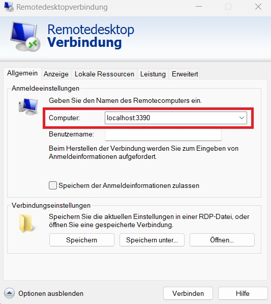
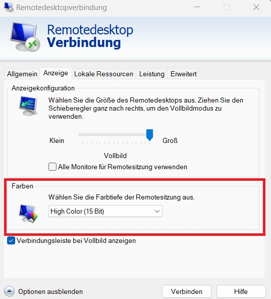
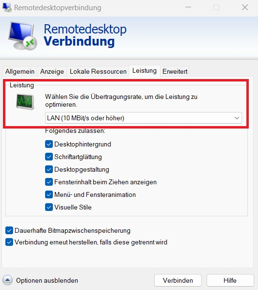
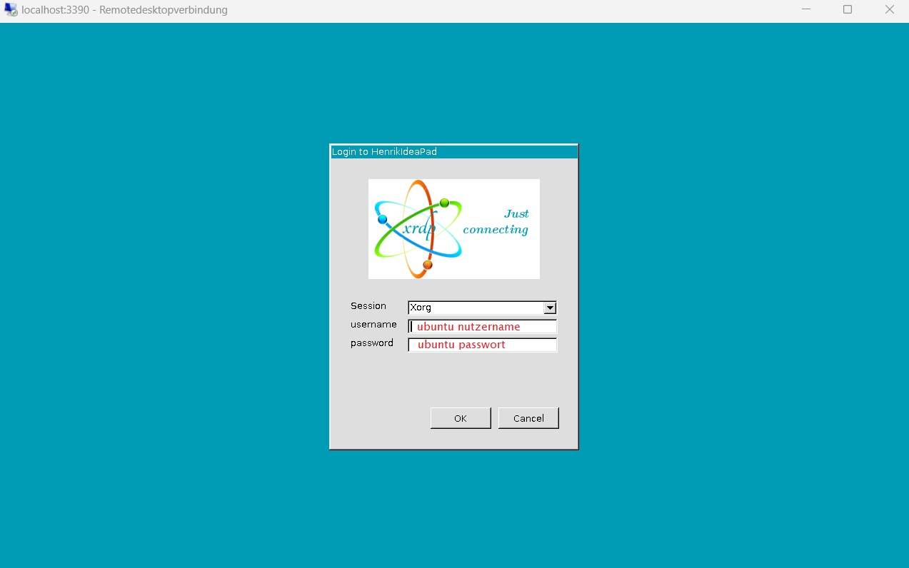
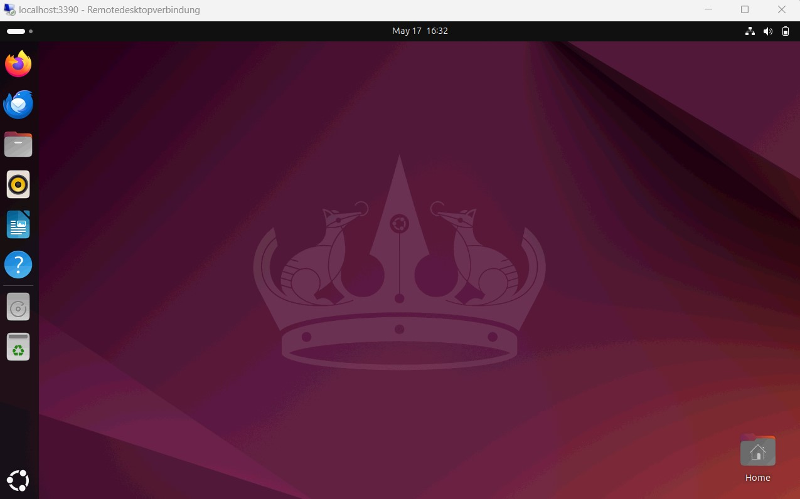

# wsl_desktop_ui
Contains instructions on how to setup a local RemoteDesktop server for accessing the Ubuntu WSL with gnome.

# Instructions:

## German:

### WSL mit Ubuntu installieren:
1. cmd als Admin öffnen.
2. Befehl `wsl --install` ausführen, um WSL und Ubuntu zu installieren.
3. PC neustarten.

4. Ubuntu starten.
5. Benutzername und Passwort festlegen.
6. Befehle ausführen, um packages zu aktualisieren:
```
sudo apt update    
sudo apt upgrade -y
```

### Gnome installieren:

7. Befehl ausführen, um error bei gnome Installation zu vermeiden:

```sudo apt-mark hold acpid acpi-support```

8. Befehl ausführen, um gnome desktop zu installieren:

```sudo apt install ubuntu-desktop gnome```

### xrdp installieren:

9. Befehle zum Einrichten des xrdp-Servers für RemoteDesktop ausführen.
   Port 3390 wird empfohlen, der Standardport 3389 wird von Windows bereits verwendet:

```
sudo apt install xrdp
sudo sed -i 's/3389/3390/g' /etc/xrdp/xrdp.ini 
sudo systemctl restart xrdp
```

10. Im home directory eine Datei mit dem Namen ".xsessionrc" erstellen.
    Die folgenden session-Informationen in die Datei kopieren:

```
export GNOME_SHELL_SESSION_MODE=ubuntu
export XDG_CURRENT_DESKTOP=ubuntu:GNOME
export XDG_DATA_DIRS=/usr/share/ubuntu:/usr/local/share:/usr/share:/var/lib/snapd/desktop
export WAYLAND_DISPLAY=
export XDG_CONFIG_DIRS=/etc/xdg/xdg-ubuntu:/etc/xdg
```

11. Ubuntu neustarten. (Fenster schließen und wieder öffnen.)

### RemoteDesktop konfigurieren und starten:

12. RemoteDesktop auf Windows Host starten. Und "optionen einblenden" wählen.
    Dort die folgenden Einstellungen vornehmen:
    
    
    
```
    Allgemein:
        Computer = localhost:<port>  (bei mir ist der Port 3390, siehe oben)
    Anzeige (optional):
        Farben = High Color (15 Bit)  (andere Einstellungen funktionieren auch, laggen nur aufgrund des langsamen Übertragungsprotokolls)
    Leistung (optional):
        Verbindungsqualität = LAN (10 MBit/s oder höher)
```

13. Auf "Verbinden" / enter klicken, Benutzer und Passwort eingeben.
    Kurz warten...
    Fertig.




